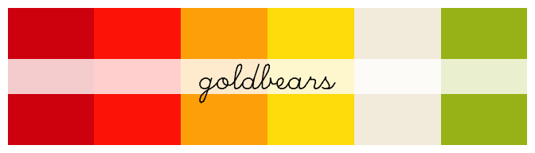
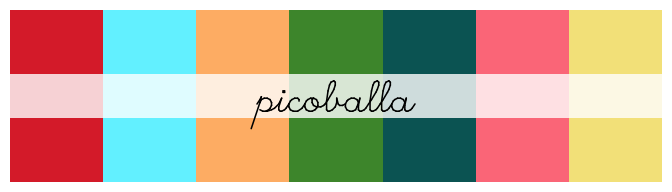
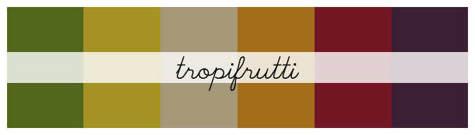
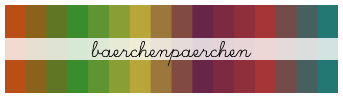

# haR: Color Palettes Inspired by Haribo Gummy Candies
Federico Marini  
<!-- README.md is generated from README.Rmd. Please edit that file -->


> haR macht Rwachsene froh!

A fruity yummy plot is what you want? Then haR is the right thing!

## Installation

Install the package by typing

```R
devtools::install_github("federicomarini/haR")
```

## Usage

Load the library and see the available palette with


```r
library(haR)

# See all palettes
names(har_palettes)
#> [1] "goldbears"        "goldbearsUS"      "konfekt"         
#> [4] "picoballa"        "baerchenpaerchen" "tropifrutti"
```

## Goldbears

The `har_palette` command returns a vector of colors, and has its own print method to display the palette generated


```r
har_palette("goldbears")
```

 

```r
# usage example
cols <- har_palette("goldbears")
# and then use cols where you normally require a col parameter 
```

#### Goldbears in action


```r
library(ggplot2)
ggplot(iris, aes(Sepal.Length, Sepal.Width, color = cut(iris$Sepal.Length,6))) + 
  geom_point(size = 3) + 
  scale_color_manual(values = har_palette("goldbears")) + 
  theme_gray()
```

 

## Goldbears in the US


```r
har_palette("goldbearsUS")
```

 


## Picoballa


```r
har_palette("picoballa")
```

 

## Konfekt


```r
har_palette("konfekt")
```

 

## Bärchen Pärchen


```r
har_palette("baerchenpaerchen")
```

 

## Tropifrutti


```r
har_palette("tropifrutti")
```

 

## Need more colors?

If you require more colors than what the palette can deliver, use `type="continuous"` to interpolate on the selected palette


```r
har_palette("konfekt",n=12,type="continuous")
```

 


```r
har_palette("baerchenpaerchen",n=16,type="continuous")
```

 

## I have no clue which candy to pick...

Wanna try some candies but you don't know which one is your favorite? 


```r
# do not provide any value to the name parameter and let fate choose for you!
# ok, here I kind of manipulate destiny with set.seed
set.seed(42)
har_palette()
```

 

## Contribute

Want more? Please send an email to marinif@uni-mainz.de, and I'll brew you a new palette with the wished candies - or send a pull request if you did the job already!

